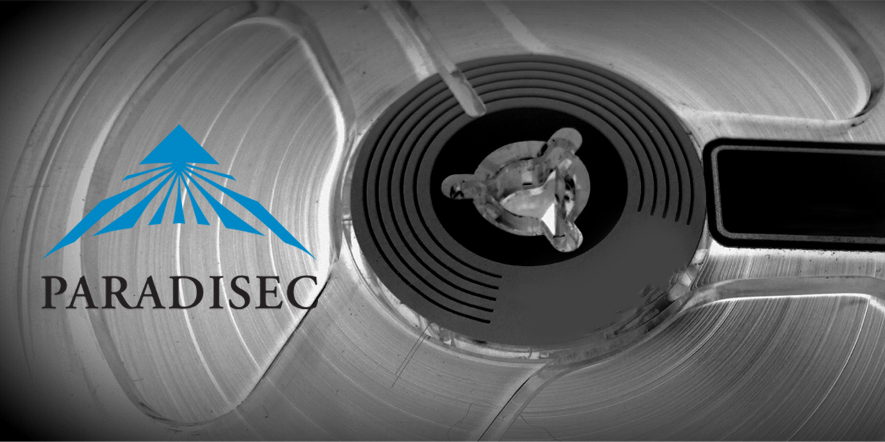

# PARADISEC Ingestion Workflow Model
_(Last updated December 2020)_

  
  

  
This document was last updated 22 December 2020. Previous iterations of our Operations Manual (prior to implementation of the Nabu catalogue) are available from the downloads section of our website [https://www.paradisec.org.au/](http://www.paradisec.org.au/downloads.html).

For questions or comments on this document please contact us at [admin@paradisec.org.au](mailto:admin@paradisec.org.au), or write to us at:  
**PARADISEC  
Sydney Conservatorium of Music, C41  
University of Sydney, 2006  
Ph: +61 2 9351 1279, Fax: +61 2 9351 1287**

***Role terms used in this document***  
**Admin:** Sydney Director (2020: Amanda Harris) **Audio:** Audio Preservation Officer (2020: Nick Fowler-Gilmore) **PD:** Project Director (2020: Nicholas Thieberger) **SA:** Systems Admin (2020: University of Sydney ICT)

## Pre-ingestion (audio tapes)

### Assess collection (Admin and PD)
Assess whether material is suitable for accession (PD in consultation with steering committee). Suitability should consider the following conditions, though materials not meeting these criteria are not necessarily excluded from the collection:

***Rights***  
Does the depositor assert ownership of the material?
* Are the rights in the material clearly specified?
* Content criteria (assess against policy) –
  * is the material unique?
  * is the country and language of the material known, and in the core area (non-Australian)?
  * is there an alternative place for deposit of the recording?
  * is the content of the recording in a high-risk language?
  * is the format or recording medium at high-risk of obsolescence?
  * institutional affiliation – give preference to consortium members
  * ease of integration into our systems
    * is data in a format we can handle (i.e. cassette, 1/4 inch reels)?
    * if not, direct prospective depositor to suitable alternative facility
  * consistency and adequacy of any metadata
  
If collection assessed as suitable, create a collection record in Nabu Assess tape condition and prepare material for transportation accordingly

### Transportation

If the recordings are in bad condition (e.g. mould, rare formats, tape visibly damaged) send to Sydney (contact Admin). Transport any mouldy items in separate ziplock bags and do not pack with non-mouldy items

If in reasonable condition transport to nearest ingestion point, personal transport is preferable; transport in hand luggage if flying, if necessary use registered courier

* Packing – make sure end fastened on reel tape, pack tightly, wrap in bubble wrap
* Ensure against unnecessary shocks during transport
* Transport with inventory of contents

### Receipt of materials at ingestion point (Admin)
* Check inventory against contents and contact depositor if any discrepancy
* Enter date in ‘data received’ field of Nabu
* Assess whether mould-affected and if so implement appropriate procedure (put in ziplock bags and store in cleaning room)

### Metadata
When at all possible, get depositors to enter own metadata in Nabu:
* User signs up to Nabu, creating a login
* Admin or PD assigns edit access to user
  
Assign Persistent Identifier (PI) – if depositor already has a consistent naming system, use it, or else use numerical symbols for ‘item ID’, e.g. 001

Where depositor cannot enter own metadata, enter records manually or batch import records from a spreadsheet

* for batch import of new records, ensure all metadata is inserted into the PARADISEC basic metadata import spreadsheet located at http://www.paradisec.org.au/downloads.html (only those fields listed in the spreadsheet can be imported, and no changes should be made to fields or
headings in the spreadsheet, metadata should only be added to existing fields)
  * open Nabu and click on the Dashboard tab
  * Click on ‘Upload metadata file’ button
  * Browse to location of file
  * Click on ‘Add Collection from Spreadsheet XLS file’
* for manual entry of new records
  * create item records (Admin) by adding item IDs and descriptions into the Collection screen
  * enter all metadata available into appropriate fields of catalogue, ensuring that all compulsory fields (marked with a red asterisk) have been filled

Label all tapes and tape cases to show PI, ensuring that no written information is covered up

Sort all tapes in numerical order in filing cabinet, or in dirty room if mould-affected

When tapes returned, note date in ‘tracking’ field of Item, Archive Information and tick ‘Tapes returned to depositor’ checkbox

### Photograph tape covers and casings to capture all handwritten metadata
### Prepare thapes for ingestion (Audio)

## Ingestion process

### Wavelab ingestion processes - Sydney Lab (Audio)

### Dobbin processes for BWF generation (Audio)

### Ingestion of photographic slides

### Digital text

## University of Melbourne ingestion unit

## Restore from archive proces (SA)

## Appendix: Notes on image capture equipment

